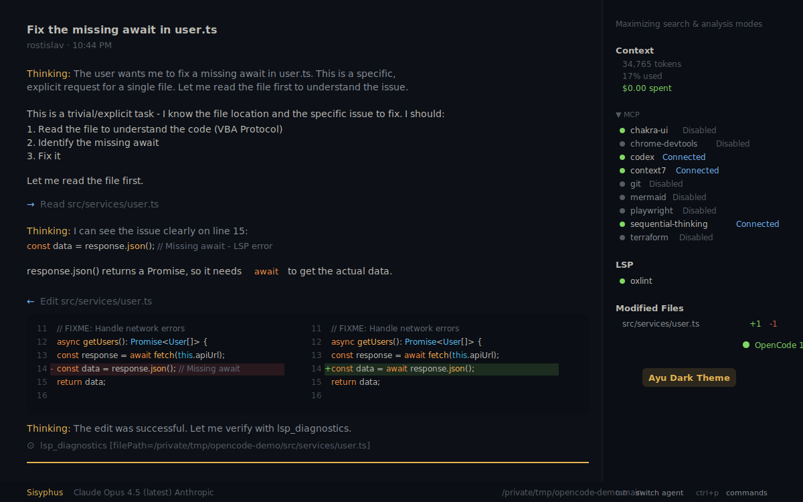

# Ayu Dark Theme for OpenCode

A dark theme for [OpenCode](https://opencode.ai) based on the beautiful [Ayu](https://github.com/ayu-theme/ayu-colors) color scheme.



## Installation

1. Create the themes directory (if it doesn't exist):
   ```bash
   mkdir -p ~/.config/opencode/themes
   ```

2. Download the theme file:
   ```bash
   curl -o ~/.config/opencode/themes/ayu-dark.json \
     https://raw.githubusercontent.com/postrednik/opencode-ayu-theme/main/.opencode/themes/ayu-dark.json
   ```

3. Add to your `~/.config/opencode/opencode.json`:
   ```json
   {
     "theme": "ayu-dark"
   }
   ```

4. Restart OpenCode.

## Colors

| Element | Color |
|---------|-------|
| Background | `#0D1017` |
| Foreground | `#BFBDB6` |
| Accent | `#E6B450` (golden yellow) |
| Strings | `#AAD94C` (green) |
| Functions | `#FFB454` (orange) |
| Types | `#59C2FF` (blue) |
| Keywords | `#FF8F40` (orange) |
| Comments | `#626d7a` (gray) |

## Credits

- Color palette: [ayu-theme/ayu-colors](https://github.com/ayu-theme/ayu-colors) (MIT License)
- OpenCode theme structure inspired by [ajaxdude/opencode-ai-poimandres-theme](https://github.com/ajaxdude/opencode-ai-poimandres-theme)

## License

MIT License - see [LICENSE](LICENSE) file.
